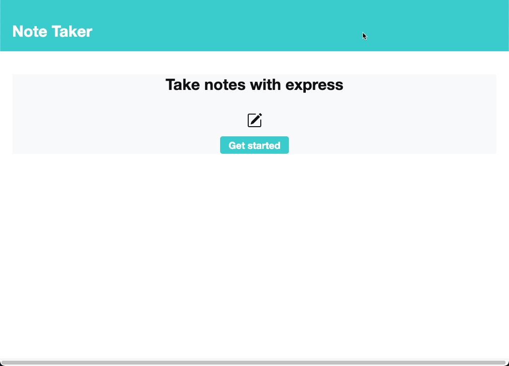
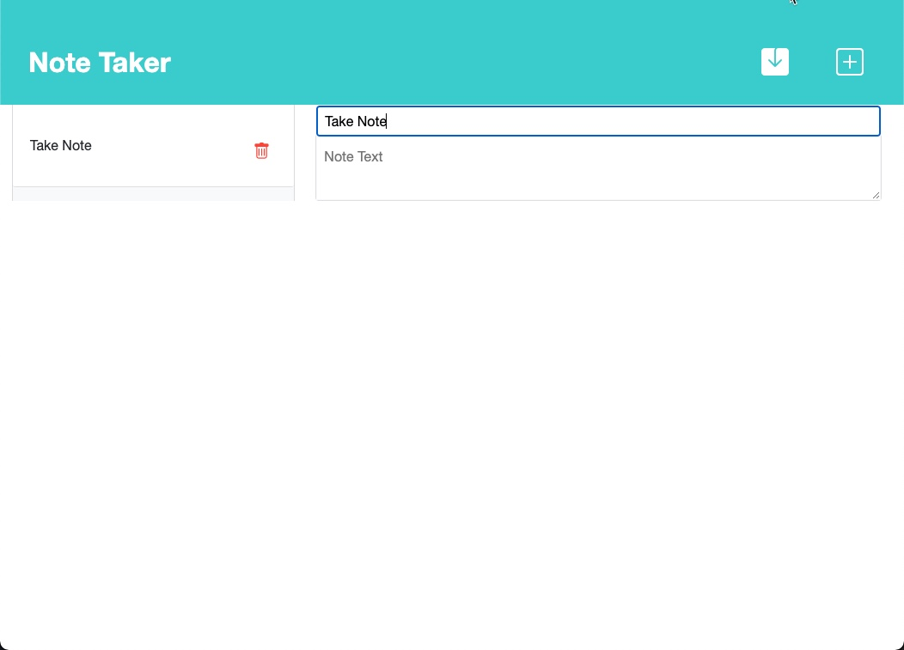
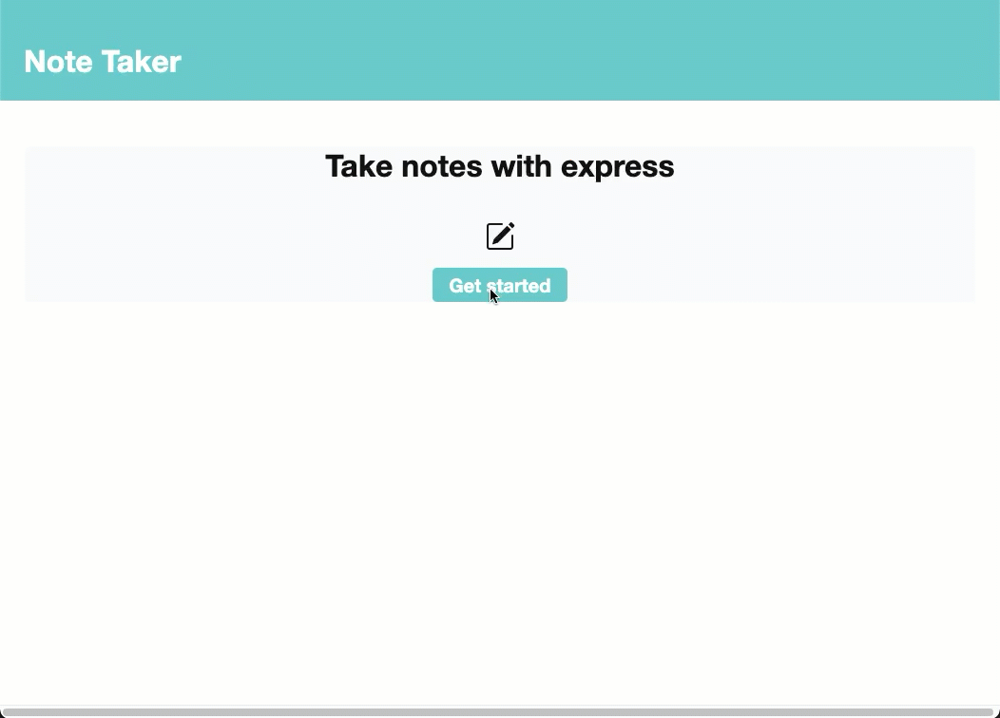

# Note Taker
## Description
This is an application called Note Taker that can be used to write and save notes. This application will use an Express.js back end and will save and retrieve note data from a JSON file.

Visit Site: 

https://note-taker-express01.herokuapp.com/

Repository: 

https://github.com/mingmanhk/Note-Taker

Main page:

Note Taker page:

## Table of Contents
1. [Installation](#installation)

2. [Usage](#usage)

3. [Credits](#credits)

4. [License](#license)

5. [Features](#features)

6. [Contribute](#contribute)

7. [Test](#test)

8. [Questions](#questions)

## Installation
To run this program required path, fs, uuid, util and express.
1. Clone this repository to use this application on local machine.
2. Install necessary dependencies, run the following command : npm i
## Usage
1. To server the Express.js server, run the following command: npm start
2. This will start localhost server on PORT 3001. 
3. Open browser and type http://localhost:3001/ to run this application on your local machine.

## Credits
Victor Lam
## License

## Features
1. Post API does update and add new record 
2. Added auto save
3. Simpify the work flow and auto hide layout to prevent user mistake
## Contribute
Victor Lam
## Test
Visit Site: 

https://note-taker-express01.herokuapp.com/
## Questions
Questions about this repository? Please contact me at [mingmanhk@gmail.com](mailto:mingmanhk@gmail.com).
View more of my work in GitHub at [mingmanhk](https://github.com/mingmanhk)